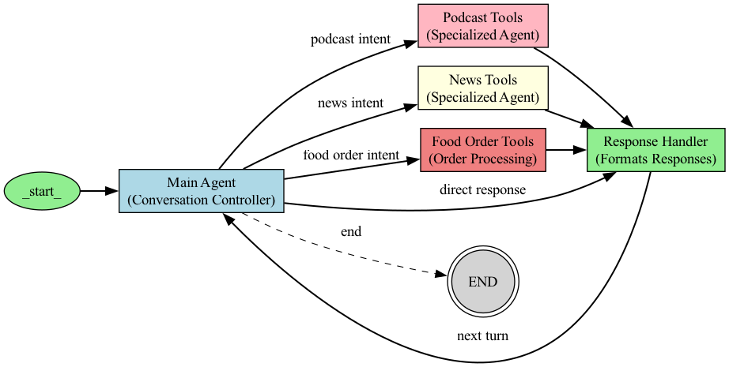

# LangGraph Memory-Enhanced Information Assistant

A conversational AI assistant built with LangGraph that uses persistent memory to remember user information across conversations. The assistant can handle multiple types of tasks including food ordering, podcast recommendations, and news searches.

## Features

- **Long-Term Memory**: Remembers user preferences, facts, and conversation history across sessions
- **Multi-Task Capabilities**: Can handle food ordering, podcast recommendations, and news searches
- **LangGraph Workflow**: Uses a directed graph architecture for task routing and processing
- **ReAct Pattern**: Implements reasoning + action pattern for complex tasks
- **Persistent Storage**: Uses langmem for efficient vector storage of memory items
- **Task Routing**: Intelligently routes user requests to specialized processing nodes
- **API Integration**: Connects with Telegram for food ordering, ListenNotes for podcasts, and news APIs

## System Architecture

### Memory System Architecture

The memory system integrates with the LangGraph workflow to provide personalized responses based on user history:

```
┌────────────────┐      ┌─────────────────┐      ┌────────────────┐
│ Memory         │      │  Main Agent     │      │ Tool Execution │
│ Retrieval      ├─────►│  (with memory   ├─────►│                │
└───────┬────────┘      │   context)      │      └────────┬───────┘
        │               └─────────────────┘               │
        ▼                                                 ▼
┌────────────────┐                               ┌────────────────┐
│ Memory         │                               │ Memory         │
│ Context Added  │                               │ Extraction     │
└────────────────┘                               └──────┬─────────┘
                                                       │
                                                       ▼
                                                ┌────────────────┐
                                                │ Memory         │
                                                │ Update         │
                                                └────────────────┘
```

### Graph Workflow Architecture

The system uses the LangGraph library to create a directed workflow that processes user queries:

1. **Entry Point**: All interactions start with memory retrieval
2. **Task Routing**: Queries are routed to specialized nodes based on intent
3. **Task Processing**: Specialized nodes handle different task types
4. **Memory Extraction**: New information is extracted from the conversation
5. **Memory Update**: User memory is updated before completing the interaction

### Memory Components:

1. **Memory Manager**: Handles CRUD operations for memory using langmem
2. **Memory Retrieval**: Loads relevant memories at conversation start
3. **Memory Extraction**: Identifies new memory items from conversations
4. **Memory Update**: Persists changes to the memory store

### Tool Components:

1. **Food Ordering**: Processes food orders and sends them via Telegram
2. **Podcast Recommendations**: Searches for podcasts using the ListenNotes API
3. **News Search**: Retrieves recent news articles on various topics
4. **Direct Response Handler**: Handles common commands without LLM involvement

### Memory Schema:

The system stores the following information about each user:

- **Identity**: User ID and name
- **Preferences**: Things the user likes and dislikes
- **Important Facts**: Key facts about the user
- **Conversation History**: Summaries of past conversations

## Setup and Installation

### Prerequisites

- Python 3.9+
- OpenAI API key

### Installation

1. Clone the repository
2. Install dependencies:

```bash
pip install -r requirements.txt
```

3. Create a `.env` file based on `.env.example`:

```bash
cp .env.example .env
```

4. Add your OpenAI API key and other API keys to the `.env` file

## Usage

### Running the Assistant

```bash
python main.py "What are some good podcasts about ancient history?"
```

### Interactive Mode

```bash
python main.py --interactive
```

This will generate a unique user ID that you can use to continue the conversation later.

### Single Query Mode

Run a single query:

```bash
python main.py "What's in the news today?"
```

To continue with the same user memory in a later session:

```bash
python main.py --user your_user_id "Tell me about recent podcasts"
```

### Debug Mode

```bash
python main.py --debug
```

The debug mode enables detailed logging to help troubleshoot issues:

- Logs are written to `debug_log.txt` in the project root
- All API calls, responses, and internal state changes are recorded
- Great for understanding the agent's decision-making process
- Can be combined with other modes: `python main.py --debug --interactive`

Example debug command for specific queries:
```bash
python main.py --debug "What's happening in world news today?"
```

### Visualization Mode

```bash
python main.py --visualize
```

This generates a visual representation of the LangGraph workflow architecture and saves it as `info_assistant_workflow.png`.



The visualization shows the complete flow of information through the system, including memory operations, task routing, and specialized task processing nodes.

### Memory Commands

While in interactive mode, you can use these special commands:

- `clear`: Start a new conversation while retaining memory
- `forget`: Delete all memory data for the current user
- `exit` or `quit`: End the session

### Import in Your Python Code

```python
from main import run_info_assistant

# Run with a query
response = run_info_assistant("Tell me about recent tech news")
print(response)

# Run with conversation tracking
response = run_info_assistant("Any updates on that news?", conversation_id="user123")
print(response)
```

## Advanced Features

### Memory Features

#### Memory Confidence

The system tracks confidence scores for each memory item, updating information only when new data has higher confidence.

#### Memory Context

Memory is retrieved contextually based on the current conversation, finding the most relevant items from the user's history.

#### Conversation Summarization

After each conversation, the system creates a summary that can be retrieved in future interactions, helping with continuity.

### Task Features

#### Food Ordering

The assistant can process food orders by:
- Extracting order details from natural language input
- Formatting the order for transmission
- Sending the order details to a designated recipient via Telegram

#### Podcast Recommendations

The assistant can recommend podcasts by:
- Understanding the user's interests (from memory and current request)
- Searching for relevant podcasts using the ListenNotes API
- Providing details including episode titles, descriptions, and links

#### News Search

The assistant can retrieve news by:
- Identifying the news topic from the user's query
- Searching for recent and relevant news articles
- Summarizing key points from multiple sources

## 📁 Project Structure

- `main.py`: Entry point for the application
- `api.py`: FastAPI implementation for REST API service
- `graph/`: Contains the LangGraph workflow definition
  - `workflow.py`: Main workflow logic and node definitions
  - `state.py`: State management for the workflow
  - `nodes.py`: Additional node functions
  - `transitions.py`: State transition logic between nodes
  - `schemas.py`: Data models and schemas for the workflow
- `memory/`: Memory system components
  - `memory_manager.py`: Core memory management functionality
  - `memory_nodes.py`: LangGraph nodes for memory operations
- `tools/`: Specialized tools for gathering information
  - `food_tools.py`: Tools for processing food orders
  - `podcast_tools.py`: Tools for podcast recommendations
  - `news_tools.py`: Tools for retrieving recent news
- `utils/`: Helper utilities
  - `formatting.py`: Response formatting functions
  - `middleware.py`: API middleware for rate limiting, caching, and connection pooling
  - `direct_response.py`: Handler for direct commands without LLM
- `config.py`: Configuration settings
- `visualize_graph.py`: Utility to visualize the workflow architecture
- `client_integration.md`: Guide for client-side integration
- `render_deployment_guide.md`: Deployment guide for Render
- `Procfile` & `render.yaml`: Configuration files for Render deployment

## 🔧 Extending the System

### Adding New Tools

To add a new tool to the assistant:

1. Create a new tool module in the `tools/` directory
2. Define your tool's functionality and API
3. Update the workflow in `graph/workflow.py` to include your new tool
4. Add any necessary formatting functions in `utils/formatting.py`
5. Update environment variables if needed

### Adding New Memory Types

To add new types of memory, extend the `UserMemorySchema` class in `memory/memory_manager.py` and add appropriate extraction and formatting methods.

### Adding New Task Types

To add new task types:

1. Create a new node function in `graph/nodes.py`
2. Add the node to the workflow in `graph/workflow.py`
3. Update the task routing logic to recognize the new task type
4. Implement any necessary tools for the task

## 🧪 Testing

Use the included test notebook to explore the assistant's capabilities:

```bash
jupyter notebook test.ipynb
```

A test file for memory functionality is also provided:

```bash
python test_memory.py
```

## 📋 Requirements

- Python 3.9+
- LangGraph
- LangChain
- OpenAI API key (or compatible model provider)
- Tavily API key for search capabilities
- ListenNotes API key for podcast recommendations
- Telegram Bot Token (for food ordering functionality)

### Additional Requirements for API Service

- FastAPI
- Uvicorn
- Redis (optional, for caching and session management)
- Python-Jose (for API authentication)
- Python-Multipart (for form data processing)

## 🔐 Environment Setup

Create a `.env` file in the root directory with the following variables:
```
# Core API Keys
OPENAI_API_KEY=your_openai_key
TAVILY_API_KEY=your_tavily_key
LISTENNOTES_API_KEY=your_listennotes_key

# Telegram Integration (for food ordering)
TELEGRAM_BOT_TOKEN=your_telegram_bot_token
TELEGRAM_CHAT_ID=your_telegram_chat_id

# API Service Configuration (optional)
API_KEYS=your_api_key1,your_api_key2
ALLOWED_ORIGINS=https://your-frontend-domain.com
REDIS_URL=redis://localhost:6379/0
API_RATE_LIMIT=100
MAX_CONVERSATION_HISTORY=50
```

Make sure to keep this file private and never commit it to your repository.

## 📄 License

This project is licensed under the MIT License - see the [LICENSE](LICENSE) file for details.

## 🤝 Contributing

Contributions are welcome! Please feel free to submit a Pull Request.

## 🙏 Acknowledgments

- Built with [LangGraph](https://github.com/langchain-ai/langgraph)
- Uses [Tavily](https://tavily.com/) for search capabilities
- Uses [ListenNotes API](https://www.listennotes.com/api/) for podcast recommendations
- Uses Telegram API for food order transmission